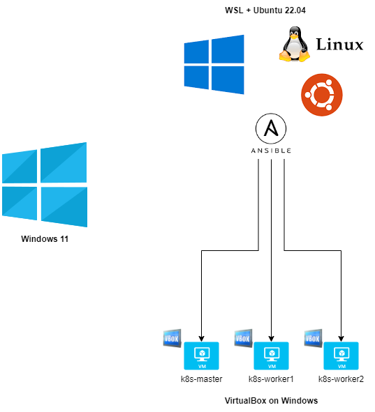

# Requirements
## Windows 11
- WSL2
- Ubuntu 22.04
- VirtualBox
  VMs with Ubuntu 22.04
- VSCode

## WSL Ubuntu 22.04
- ansible
- sshpass

```
apt update && apt install -y ansible sshpass
```

# Environment




# Configure Ansible server (WSL2)
## 1. Create 3 vms
- 1 master
- 2 workers
- vms credentials
  - user: osboxes
  - password: osboxes.org

```
cd vms
./virtualbox_create_vms_k8s.sh

or

./virtualbox_create_vm.sh kube-master
./virtualbox_create_vm.sh kube-worker1
./virtualbox_create_vm.sh kube-worker2
```

## 2. Configure /etc/hosts file (only if vm was created one by one)
```
./set_ansible_hosts_on_ansible_server.sh        # set hosts on /etc/hosts server file
cat /etc/hosts                                  # check hosts on /etc/hosts file
```

## 4. Create ssh key on Ansible server
```
ssh-keygen -f ~/.ssh/key_ansible
```

## 5. Copy publick key Ansible server to Ansible hosts
```
ssh-copy-id osboxes@k8s-master
ssh-copy-id osboxes@k8s-worker1
ssh-copy-id osboxes@k8s-worker2

or

echo password > password

for user in osboxes
do
  for instance in k8s-master k8s-worker1 k8s-worker2
  do
    sshpass -f password.txt ssh-copy-id -o StrictHostKeyChecking=no ${user}@${instance}
  done
done
```

## 6. Check connectiviy
```
ansible -i k8s-master,k8s-worker1,k8s-worker2 all -m ping --user osboxes
```

## 7. Configure Ansible inventory
```
cat > /etc/hosts <<EOF
[masters]
master ansible_host=k8s-master ansible_user=osboxes

[workers]
worker1 ansible_host=k8s-worker1 ansible_user=osboxes
worker2 ansible_host=k8s-worker2 ansible_user=osboxes

[all:vars]
ansible_python_interpreter=/usr/bin/python3
EOF
```

## 8. List inventory
```
ansible-inventory --list -y
```

## 9. Ping all hosts
```
ansible all -m ping
```

## 10. Run playbooks
1. [setup.yml](./playbooks/setup.yml)
2. [master-node.yml](./playbooks/master-node.yml)
3. [worker-node.yml](./playbooks/worker-nodes.yml)

```
ansible-playbook setup.yml              # install and configure 3 vms
ansible-playbook master-node.yml        # create Kubernetes cluster
ansible-playbook worker-nodes.yml       # add worker nodes to cluster Kubernetes
```

# Notes
```
sudo -u k8s -s                                                                        # access k8s user
sudo -u k8s passwd                                                                    # change password
ansible-playbook playbook.yml -l master --extra-vars "ansible_sudo_pass=osboxes.org"  # execute playbook for 1 server
ansible-playbook playbook.yml --extra-vars "ansible_sudo_pass=osboxes.org"            # execute playbook with password
```

# Links
- [Ansible on Ubuntu](https://www.digitalocean.com/community/tutorials/como-instalar-e-configurar-o-ansible-no-ubuntu-18-04-pt)
- [Running playbooks](https://www.digitalocean.com/community/tutorials/how-to-use-ansible-to-install-and-set-up-docker-on-ubuntu-18-04-pt)
- [Ansible playbooks](https://github.com/do-community/ansible-playbooks)
- [Install Kubernetes on Ubuntu 22.04](https://www.linuxtechi.com/install-kubernetes-on-ubuntu-22-04/)
